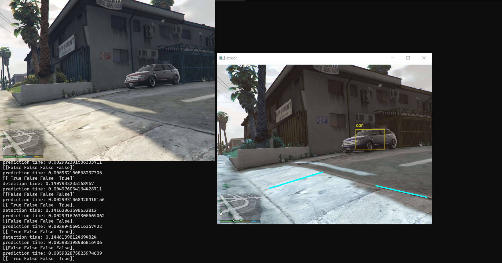

# GTA Self Driving
This repo contains `python` scripts that try learn the machine to drive a car in GTA.
Currently the models are only tested on GTA V.



# Models
There are 3 models in this repo:
- [gta_self_driving.py](./gta_self_driving.py)
  This is a machine learning model where you first generate training and test data via playing the game.
  Then this model will train on this data and try to teach itself to drive.
  To use this model enter command `python gta_self_driving.py [-o|--objectdetection] <object detection filename> [-l|--lanedetection] <lane detection filename> [-t|--task] <generate, train, predict>`
  requirements:
  ```
  numpy
  pyautogui
  sklearn
  pandas
  tensorflow
  keras
  scipy
  numpy
  cvlib
  Pillow
  pyinput
  ```

- [gta_self_driving_evolution_algo.py](./gta_self_driving_evolution_algo.py)
  This is a neuro evolution model that will try to start driving with a starting population of 20 drivers.
  It will give a score based on comparison between current and old frames, the more the frames are different the higher the score.
  e.g. the more it is driving the better score.
  Then it will create a new population based on the 2 best scoring drivers with some random mutations.
  To use this model enter command `python gta_self_driving_evolution_algo.py`
  requirements:
  ```
  cv2
  numpy
  pyautogui
  pandas
  Pillow
  ```

- [gta_self_driving_lane_detection.py](./gta_self_driving_lane_detection.py)
  This model is an attempt to create a lane detection algorithm using image processing.
  Then it tries to make self driving prediction analyzing the detected lanes.
  To use this model enter command `python gta_self_driving_lane_detection.py`
  requirements:
  ```
  cv2
  numpy
  pyautogui
  pandas
  Pillow
  ```
  
# How to use the models
For all the models you need to startup the game in windowed mode on 800x600 resolution.<br>
Then put the game window in the top left corner of your screen.<br>
The scripts will start recording and analysing the top left 800x630 box (a bit of margin for the border) on your screen.<br>
You can ofcourse change this by changing the values in the `ImageGrag.grab(pos_x, pos_y, width, height)` function in the scripts.

## gta self driving machine learning model
Like stated previously you can start this model using the command `python gta_self_driving.py [-o|--objectdetection] <object detection filename> [-l|--lanedetection] <lane detection filename> [-t|--task] <generate, train, predict>`<br>
options:
- *-o | --objectdetection*: provide the filename for your object detection training data, models and prediction data. The data will be stored in a file with the provided name respectively in the folders training_data, models and prediction_data.
- *-l | --lanedetection*: provide the filename for your lane detection training data, models and prediction data.
- *-t | --task*: this can be one of multiple values
  - `generate`: generate training data for the models, this requires you to be driving around in the game in first person view so the training data contains inputs per frame. To quit generating you can press `q`.
  - `train`: train the models on the generated training data.
- `predict`: start the game in a car and this script with this task on to have the AI driving the car based on the models it was trained on. To stop the AI from driving you can press `q`.

## gta self driving evolution algo
To start this model enter command `python gta_self_driving_evolution_algo.py`.<br>
Start this model while the game is loaded and the character is placed in a car on **first person view**.<br>
The model will start driving automatically when it is started.<br>
To quit you can press the key `q`.

## gta self drivinng lane detection algo
To start this model enter command `python gta_self_driving_lane_detection.py`.<br>
Start this model while the game is loaded and the character is placed in a car on **first person view**.<br>
The model will start driving automatically when it is started.<br>
To quit you can press the key `q`.
